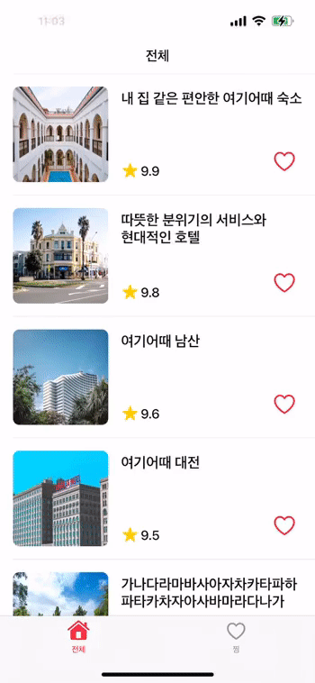

# Hotel

### 결과
전체 리스트 화면 및 페이징 기능|즐겨찾기 화면 및 정렬 기능
:-:|:-:
|

즐겨찾기 토글 기능|상세화면 및 상세화면에서 즐겨찾기 토글 기능
:-:|:-:
|

### 라이브러리(SPM)
- SnapKit(Code-base UI)

### 화면 구성
- 2개의 리스트와 상세 화면으로 구성

### 리스트 화면
- 전체 리스트와 즐겨찾기 리스트 2개를 탭으로 구성(O)
- 리스트 아이템 클릭시 해당 아이템 상세 화면으로 이동(O)

    **가. 전체 리스트**(`TotalListViewController`)
    - 리스트는 이미지, 제목, 평점, 즐겨찾기 토글 버튼으로 구성(O)
    - 페이징 기능 구현(O)
    - 페이지 구성은 20개 단위(O)
    
    **나. 즐겨찾기 리스트**(`BookmarkViewController`)
    - 리스트는 이미지, 제목, 평점, 즐겨찾기 등록시간, 즐겨찾기 토글 버튼으로 구성(O)
    - 즐겨찾기 관련 정보는 로컬 저장(O)
    - 즐겨찾기 최근등록순, 평점순 정렬 기능 구현 (오름차순, 내림차순)(O)

### 상세 화면(`DetailViewController`)
- 원본 이미지, 제목, 상세정보들을 화면에 표기(O)
- 즐겨찾기 토글 기능(O)
